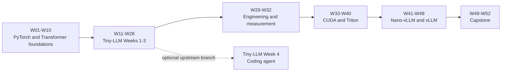

# Mapping This Curriculum to Tiny-LLM

This repository and [Tiny-LLM](https://github.com/skyzh/tiny-llm) are complementary rather than competing courses:

- this repository provides a beginner-oriented, 52-week learning path across PyTorch, MLX/Metal, CUDA, Triton, Nano-vLLM, and vLLM;
- Tiny-LLM provides the runnable exercises, tests, reference implementation, and Qwen3 serving stack used during Phase 2 of this curriculum.

Tiny-LLM expects basic deep-learning knowledge and familiarity with PyTorch. Weeks 01-10 of this curriculum supply that background before the learner begins the upstream course. Weeks 11-28 then expand Tiny-LLM Weeks 1-3 into a lower-intensity path of roughly eight hours per week.

## Course-level relationship

| Dimension | This curriculum | Tiny-LLM |
|---|---|---|
| Role | Learning plan, lab organization, acceptance criteria, and cross-platform progression | Executable implementation course with tests and reference solutions |
| Pace | 52 weeks at about eight hours per week | Four intensive project weeks |
| Starting point | Beginner-level PyTorch and Transformer foundations | Basic deep learning and familiarity with PyTorch |
| Primary hardware | CPU Linux, Apple-silicon Mac, and NVIDIA Linux | Apple-silicon Mac |
| Technology path | PyTorch -> MLX/Metal -> CUDA/Triton -> serving frameworks | MLX -> Metal -> mini-vLLM -> coding agent |
| End goal | Understand, implement, and evaluate modern LLM inference systems | Build a compact Qwen3 serving system end to end |

The curriculum pages in this repository do not replace the Tiny-LLM exercises. During Phase 2, keep Tiny-LLM as a sibling checkout, implement its learner tasks there, and use this repository for plans, notes, reports, benchmarks, and any long-lived companion projects.

## Weeks 01-10: prerequisites for Tiny-LLM

These weeks do not correspond to an upstream Tiny-LLM week. They prepare the concepts and tools that Tiny-LLM assumes.

| This curriculum | Preparation for Tiny-LLM |
|---|---|
| W01-W02 | Tensors, shapes, broadcasting, strides, views, and contiguity |
| W03-W04 | Modules, parameters, state dictionaries, autograd, and the distinction between training and inference |
| W05 | Numerical correctness, tests, profiling, and trustworthy comparisons |
| W06 | Embeddings, linear layers, softmax, and masks |
| W07 | Multi-head attention and grouped-query attention |
| W08 | RoPE, RMSNorm, and SwiGLU |
| W09 | Decoder blocks, logits, and sampling |
| W10 | Autoregressive decoding and a simple KV cache |

W01-W05 establish array-programming and PyTorch fluency. W06-W10 pre-study the operators and inference flow that will be rebuilt with MLX in Tiny-LLM Week 1.

## Tiny-LLM setup and Week 1

Tiny-LLM Week 1 builds a readable Qwen3 model from array and matrix operations. See the upstream [Week 1 overview](https://skyzh.github.io/tiny-llm/week1-overview.html).

| Tiny-LLM checkpoint | This curriculum | Relationship |
|---|---:|---|
| Environment setup, MLX, and model download | W11 | Run the reference path and pin all relevant versions |
| Day 1: Attention and MHA | W12 | Direct mapping |
| Day 2: RoPE | W13 | Combined with GQA and layout verification |
| Day 3: GQA | W13 | Combined with RoPE and layout verification |
| Day 4: RMSNorm and MLP | W14 | Direct mapping |
| Day 5: Qwen3 model | W15 | Assemble one block and then the complete model |
| Day 6: Generation | W16 | Weight loading and autoregressive generation |
| Day 7: Sampling | W16 | Completed together with generation and the Week 1 review |

The seven upstream learner days are deliberately expanded into six curriculum weeks so that MLX is not introduced at the same time as every Transformer concept.

## Tiny-LLM Week 2

Tiny-LLM Week 2 adds a dense KV cache, synchronized measurement, quantized projections, fused kernels, decode attention, and increasingly specialized Metal prefill kernels. See the upstream [Week 2 overview](https://skyzh.github.io/tiny-llm/week2-overview.html).

| Tiny-LLM checkpoint | This curriculum | Relationship |
|---|---:|---|
| Dense KV cache | W17 | Direct mapping; cache state and correctness are required |
| Benchmarking and profiling | W18 | Direct mapping, with additional roofline reasoning |
| Metal execution fundamentals | W19 | An extra prerequisite inserted by this curriculum |
| Quantized matvec and W4A16 | W21 | Study the mechanism and choose an implementation path |
| Fused model kernels | W20 | Fully implement at least one representative fused operator |
| Decode attention | W21 | Study online softmax, test the interface, and record the implementation choice |
| SIMD-matrix prefill | W22 or optional follow-up | Integrate if selected; not required on the core path |
| Split-K prefill | W22 or optional follow-up | Integrate if selected; not required on the core path |
| Complete Week 2 comparison | W22 | Validate selected kernels with matched end-to-end workloads |

This phase intentionally does not require every specialized Metal kernel. The required core is:

1. implement and understand the dense KV-cache state flow;
2. establish a synchronized and reproducible benchmark;
3. implement at least one custom Metal fused operator end to end;
4. understand the purpose and trade-offs of the remaining kernels;
5. preserve the Tiny-LLM interfaces needed by Week 3.

Tiny-LLM documents operator off-ramps for learners who want to continue into Week 3 without hand-writing every Week 2 kernel. An optimized MLX operator may replace a custom operator at the documented seam, but this is not equivalent to bypassing the course stack with the full MLX model. The dense-cache, model-state, attention, and scheduling interfaces still need to remain intact.

Completing every Metal checkpoint remains a valuable optional specialization after the main 52-week path.

## Tiny-LLM Week 3

Tiny-LLM Week 3 turns the single-request model into a small serving engine. The topic mapping is nearly one-to-one.

| Tiny-LLM checkpoint | This curriculum | Relationship |
|---|---:|---|
| Continuous batching | W23 | Direct mapping |
| Chunked prefill | W24 | Direct mapping, including fairness and token budgets |
| Paged KV cache | W25 | Direct mapping through allocator and block-table invariants |
| Direct paged attention | W26 | Direct mapping; the hot path must not rebuild dense KV |
| Paged FlashAttention/prefill | W27 | Extended with system-level serving measurements |
| Week 3 integration | W28 | End-to-end scheduling, page lifecycle, and performance review |
| Speculative decoding | Optional | Not part of the required 52-week path |
| Mixture of Experts | Optional | Not part of the required 52-week path |

W27-W28 emphasize system behavior as well as operator correctness. Measurements should include TTFT, TPOT, throughput, memory or KV-page usage, prompt length, and concurrency.

## Tiny-LLM Week 4 is a separate branch

The current Tiny-LLM course includes a fourth week about building a local coding agent: agent loops, tools, safety boundaries, checkpoints, context compaction, steering, recovery, and evaluation.

That material is not currently part of the required 52-week path. After W28, this curriculum instead continues toward production-oriented inference engineering:

- W29-W32: reproducibility, APIs, load generation, and experiment reporting;
- W33-W36: CUDA;
- W37-W40: Triton;
- W41-W44: Nano-vLLM;
- W45-W48: vLLM;
- W49-W52: a measured capstone project.

Tiny-LLM Week 4 can be studied later as an optional branch or used as the basis of the capstone. It is not a prerequisite for CUDA, Triton, Nano-vLLM, or vLLM.

## Recommended execution sequence

1. Complete W01-W10 on CPU Linux or the M4 Mac.
2. At W11, clone Tiny-LLM beside this repository, pin a known commit, and record it in `upstreams/repos.yaml` and `upstreams/tiny-llm-notes.md`.
3. Complete Tiny-LLM Weeks 1-3 on the M4 while using W11-W28 as the pacing and acceptance guide.
4. For Week 2 kernels, follow the required core above and explicitly document every MLX substitution.
5. After W28, keep Tiny-LLM as a compact reference system and move to the engineering, NVIDIA, and serving-framework phases.
6. Revisit the complete Metal path or Tiny-LLM Week 4 only when it supports a specific learning goal or capstone question.

## Version-drift rule

Tiny-LLM is actively developed, and its chapter order, tests, implementation boundaries, and optional material can change. Do not follow a moving `main` branch throughout Phase 2.

At W11, record:

- the Tiny-LLM commit;
- the documentation version or access date;
- the MLX and `mlx-lm` versions;
- the model checkpoint;
- local patches and known deviations from this mapping.

If the pinned upstream version differs from this document, preserve the conceptual sequence but use the pinned upstream tests as the implementation contract. Update this mapping only when intentionally adopting a newer Tiny-LLM revision.
